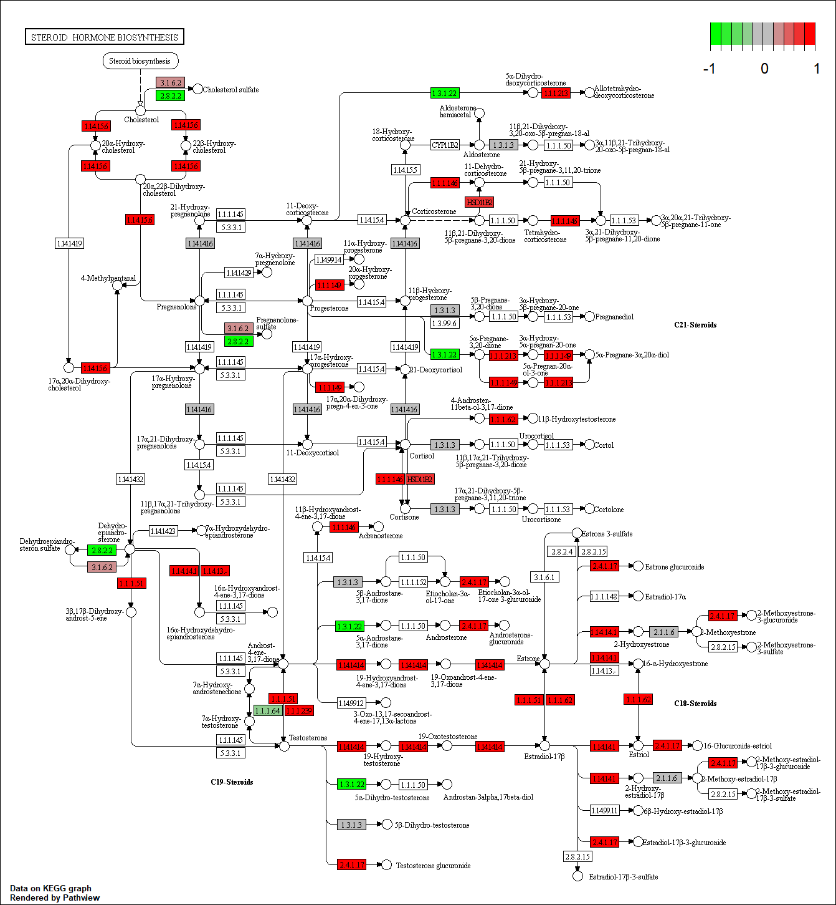

```{r setup, include=FALSE}
knitr::opts_chunk$set(echo = TRUE)
```

# Pathway analysis from RNA-seq differential expression results


## Differential Expression Analysis

```{r}
library(DESeq2)
```

Load data files

```{r}
metaFile <- "Data/GSE37704_metadata.csv"
countFile <- "Data/GSE37704_featurecounts.csv"

# Import metadata and take a peak
colData <- read.csv(metaFile, row.names=1)
head(colData)

```

```{r}
# Import countdata
countData = read.csv(countFile, row.names=1)
head(countData)
```

Remove the first 'length' column from 'countData' data.frame

```{r}
# Note we need to remove the odd first $length col
countData <- as.matrix(countData[,-1])
head(countData)
```

Remove zero entries 

```{r}
countData = countData[rowSums(countData)>1, ]
head(countData)
```

Lets setup the DESeqDataSet object required for the DESeq() function and then run the DESeq pipeline

```{r}
dds <- DESeqDataSetFromMatrix(countData=countData,
                             colData=colData,
                             design=~condition)
dds <- DESeq(dds)
```

```{r}
dds
```

```{r}
resultsNames(dds)
```


Get results for the HoxA1 knockdown versus control siRNA

```{r}
res <- results(dds, contrast=c("condition", "hoxa1_kd", "control_sirna"))
```

Let’s reorder these results by p-value and call summary() on the results object to get a sense of how many genes are up or down-regulated at the default FDR of 0.1.

```{r}
res <- res[order(res$pvalue),]
summary(res)
```

Since we mapped and counted against the Ensembl annotation, our results only have information about Ensembl gene IDs. However, our pathway analysis downstream will use KEGG pathways, and genes in KEGG pathways are annotated with Entrez gene IDs. So lets add them as we did the last day.

```{r}
library("AnnotationDbi")
library("org.Hs.eg.db")

columns(org.Hs.eg.db)
```

```{r}
res$symbol <- mapIds(org.Hs.eg.db,
                    keys=row.names(res), 
                    column="SYMBOL",
                    keytype="ENSEMBL",
                    multiVals="first")

res$entrez <- mapIds(org.Hs.eg.db,
                    keys=row.names(res), 
                    column="ENTREZID",
                    keytype="ENSEMBL",
                    multiVals="first")

res$name <- mapIds(org.Hs.eg.db,
                    keys=row.names(res), 
                    column="GENENAME",
                    keytype="ENSEMBL",
                    multiVals="first")

head(res, 10)
```


## Pathway Analysis

Here we are going to use the gage package for pathway analysis. Once we have a list of enriched pathways, we’re going to use the pathview package to draw pathway diagrams, shading the molecules in the pathway by their degree of up/down-regulation.

### KEGG

```{r}
#source("http://bioconductor.org/biocLite.R")
#biocLite( c("pathview", "gage", "gageData") )
```

```{r}
library(pathview)
library(gage)
library(gageData)
```

```{r}
data(kegg.sets.hs)
data(sigmet.idx.hs)

kegg.sets.hs = kegg.sets.hs[sigmet.idx.hs]
head(kegg.sets.hs, 3)
```

The main gage() function requires a named vector of fold changes, where the names of the values are the Entrez gene IDs.

```{r}
foldchanges <- res$log2FoldChange
names(foldchanges) <- res$entrez
head(foldchanges)
```

Now, let’s run the pathway analysis.

Here, we’re using same.dir=TRUE, which will give us separate lists for pathways that are upregulated versus pathways that are down-regulated. Let’s look at the first few results from each.

```{r}
# Get the results
keggres <- gage(foldchanges, gsets=kegg.sets.hs, same.dir=TRUE)

attributes(keggres)
```

```{r}
head(keggres$greater)
```

```{r}
head(keggres$less)
```

Each "keggres$greater" and "keggres$less" object is data matrix with gene sets as rows sorted by p-value. Lets look at both up (greater), down (less), and statistics by calling head() with the lapply() function.

```{r}
lapply(keggres, head)
```

Now, let’s process the results to pull out the top 5 upregulated pathways, then further process that just to get the IDs. We’ll use these KEGG pathway IDs downstream for plotting.

```{r}
pathways = data.frame(id=rownames(keggres$greater), keggres$greater)
head(pathways)
```

```{r}
pathview(gene.data=foldchanges, pathway.id="hsa04110")
```

Here is the default low resolution raster PNG output from the first pathview() call above:


You can play with the other input arguments to pathview() to change the dispay in various ways including generating a PDF graph. For example:

```{r}
pathview(gene.data=foldchanges, pathway.id="hsa04110", kegg.native=FALSE)
```

Now, let’s process our results a bit more to automagicaly pull out the top 5 upregulated pathways, then further process that just to get the IDs needed by the pathview() function. We’ll use these KEGG pathway IDs for plotting below.

```{r}
## Focus on top 5 upregulated pathways here for demo purposes only
keggrespathways <- rownames(keggres$greater)[1:5]

# Extract the IDs part of each string
keggresids <- substr(keggrespathways, start=1, stop=8)
keggresids
```

Finally, lets pass these IDs in keggresids to the pathview() function to draw plots for all the top 5 pathways.

```{r}
pathview(gene.data=foldchanges, pathway.id=keggresids, species="hsa")
```





## Gene Ontology (GO)

We can also do a similar procedure with gene ontology. Similar to above, go.sets.hs has all GO terms. go.subs.hs is a named list containing indexes for the BP, CC, and MF ontologies. Let’s only do Biological Process.

```{r}
data(go.sets.hs)
data(go.subs.hs)
gobpsets <- go.sets.hs[go.subs.hs$BP]

gobpres <- gage(foldchanges, gsets=gobpsets, same.dir=TRUE)

lapply(gobpres, head)
```

## Reactome Pathway Analysis

Let’s now conduct over-representation enrichment analysis and pathway-topology analysis with Reactome using the previous list of significant genes generated from our differential expression results above.

First, Using R, output the list of significant genes at the 0.05 level as a plain text file:

```{r}
sig_genes <- res[res$padj <= 0.05 & !is.na(res$padj), "symbol"]
print(paste("Total number of significant genes:", length(sig_genes)))
```

```{r}
write.table(sig_genes, file="significant_genes.txt", row.names=FALSE, col.names=FALSE, quote=FALSE)
```

Then, to perform pathway analysis online go to the Reactome website <https://reactome.org/PathwayBrowser/#TOOL=AT>. Select “choose file” to upload your significant gene list. Then, select the parameters “Project to Humans”, then click “Analyze”.

## GO Analysis

To perform Gene Set GO Enrichment online go to the website <http://www.geneontology.org/page/go-enrichment-analysis>. Paste your significant gene list from above. Then, select “biological process” and “homo sapiens”, and click submit.


