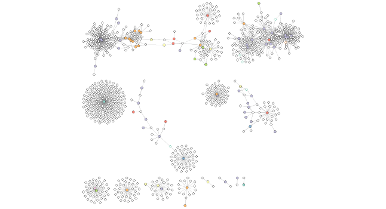
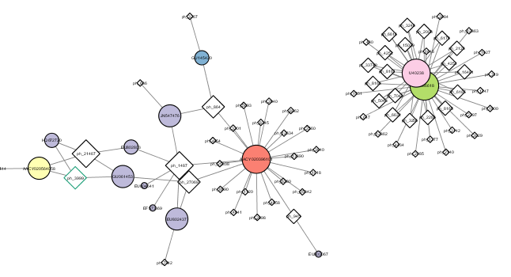

```{r setup, include=FALSE}
knitr::opts_chunk$set(echo = TRUE)
```

### Metagenomics co-occurrence networks

## Set up Cytoscape and the igraph R package

```{r}
library(RCy3)
library(igraph)
library(RColorBrewer)
```

The whole point of RCy3 package is to connect with Cytoscape. You will need to install and launch Cytoscape if you have not already done so.

These functions are a convenient way to verify a connection to Cytoscape and for logging the versions of CyREST and Cytoscape in your scripts.

```{r}
library(RCy3)
cwd <- demoSimpleGraph()
```

```{r}
layoutNetwork(cwd, 'force-directed')

# choose any of the other possible layouts e.g.:
possible.layout.names <- getLayoutNames(cwd)
layoutNetwork (cwd, possible.layout.names[1])

# Test the connection to Cytoscape.
ping(cwd)
```

If you turn to your Cytoscape window you should now see a simple 3 vertex and 3 edge network displayed (see below).

Cytoscape provides a number of canned visual styles. The code below explores some of these styles. For example check out the marquee style!


```{r}
setVisualStyle(cwd, "Marquee")
```

```{r}
saveImage(cwd, file.name = "demo", image.type = "png", h = 350)
```

```{r}
library(knitr)

```


You can find out what other styles are available and try a couple:

```{r}
styles <- getVisualStyleNames(cwd)
styles
```

## Read our metagenomics data

We will read in a species co-occurrence matrix that was calculated using Spearman Rank coefficient. (see reference Lima-Mendez et al. (2015) for details).

```{r}
prok_vir_cor <- read.delim("Data/virus_prok_cor_abundant.tsv", stringsAsFactors = FALSE)


head(prok_vir_cor)
```


Here we will use the igraph package to convert the co-occurrence dataframe into a network that we can send to Cytoscape. In this case our graph is undirected (so we will set directed = FALSE) since we do not have any information about the direction of the interactions from this type of data.

```{r}
g <- graph.data.frame(prok_vir_cor, directed = FALSE)
```

We can check the class of our new object g and see that is is of class igraph. Therefore the print.igraph() function will be called when we type it’s name allowing us have an informative overview of the graph structure.

```{r}
class(g)
```

```{r}
g
```

In this case the first line of output (“UNW- 854 1544 –”) tells that our network graph has 845 vertices (i.e. nodes, which represent our bacteria and viruses) and 1544 edges (i.e. linking lines, which indicate their co-occurrence). Note that the first four characters (i.e. the “UNW-” part) tell us about the network setup. In this case our network is Undirected, Named (i.e. has the ‘name’ node/vertex attribute set) and Weighted (i.e. the ‘weight’ edge attribute is set).

Common igraph functions for creating network graphs include: graph_from_data_frame(), graph_from_edgelist(), and graph_from_adjacency_matrix(). You can find out more about these functions from their associated help pages.

Our current graph is a little too dense in terms of node labels etc. to have a useful ‘default’ plot figure. But we can have a look anyway.

```{r}
plot(g)
```

Not very pretty! We can tune lots of plot attributes (see the help page ?igraph.plotting for details). Here we turn down our vertex size from the default value of 15 and turn of our vertex labels.

```{r}
plot(g, vertex.size = 3, vertex.label = NA)
```

Note that we can query (and set) vertex and edge attributes with the V() and E() functions respectively:

```{r}
V(g)
```

```{r}
E(g)
```

There are also the functions vertex.attributes() and edge.attributes() that query all vertex and edge attributes of a igraph object. We will use one of these functions in the next section below.


## Read in taxonomic classification

```{r}
phage_id_affiliation <- read.delim("Data/phage_ids_with_affiliation.tsv")
head(phage_id_affiliation)
```

```{r}
bac_id_affi <- read.delim("Data/prok_tax_from_silva.tsv")
head(bac_id_affi)
```


## Add the taxonomic classifications to the network and then send network to Cytoscape

In preparation for sending the networks to Cytoscape we will add in the taxonomic data.


Create our own gene network "genenet" for cytoscape

```{r}
genenet.nodes <- as.data.frame(vertex.attributes(g))
head(genenet.nodes)
```

Not all have classifications so create empty comlumns

```{r}
genenet.nodes$phage_aff <- rep("not_class", nrow(genenet.nodes))
genenet.nodes$Tax_order <- rep("not_class", nrow(genenet.nodes))
genenet.nodes$Tax_subfamily <- rep("not_class", nrow(genenet.nodes))

for (row in seq_along(1:nrow(genenet.nodes))){
  if (genenet.nodes$name[row] %in% phage_id_affiliation$first_sheet.Phage_id_network){
    id_name <- as.character(genenet.nodes$name[row])
    aff_to_add <- unique(subset(phage_id_affiliation,
                                first_sheet.Phage_id_network == id_name,
                                select = c(phage_affiliation,
                                           Tax_order,
                                           Tax_subfamily)))
    genenet.nodes$phage_aff[row] <- as.character(aff_to_add$phage_affiliation)
    genenet.nodes$Tax_order[row] <- as.character(aff_to_add$Tax_order)
    genenet.nodes$Tax_subfamily[row] <- as.character(aff_to_add$Tax_subfamily)
  }
}


head(genenet.nodes)
```

Do the same with Proks

```{r}
genenet.nodes$prok_king <- rep("not_class", nrow(genenet.nodes))
genenet.nodes$prok_tax_phylum <- rep("not_class", nrow(genenet.nodes))
genenet.nodes$prok_tax_class <- rep("not_class", nrow(genenet.nodes))

for (row in seq_along(1:nrow(genenet.nodes))){
  if (genenet.nodes$name[row] %in% bac_id_affi$Accession_ID){
    aff_to_add <- unique(subset(bac_id_affi,
                                Accession_ID == as.character(genenet.nodes$name[row]),
                                select = c(Kingdom,
                                           Phylum,
                                           Class)))
    
    genenet.nodes$prok_king[row] <- as.character(aff_to_add$Kingdom)
    genenet.nodes$prok_tax_phylum[row] <- as.character(aff_to_add$Phylum)
    genenet.nodes$prok_tax_class[row] <- as.character(aff_to_add$Class)
  }
}


head(genenet.nodes)
```

Add to the network the data related to the connections between the organisms, the edge data, and then prepare to send the nodes and edges to Cytoscape using the function cyPlot().

```{r}
genenet.edges <- data.frame(igraph::as_edgelist(g))
names(genenet.edges) <- c("name.1", "name.2")

genenet.edges$Weight <- igraph::edge_attr(g)[[1]]

genenet.edges$name.1 <- as.character(genenet.edges$name.1)
genenet.edges$name.2 <- as.character(genenet.edges$name.2)
genenet.nodes$name <- as.character(genenet.nodes$name)

ug <- cyPlot(genenet.nodes,genenet.edges)
```


Now we will send the network from R to Cytoscape.

To begin we create a connection in R that we can use to manipulate the networks and then we will delete any windows that were already in Cytoscape so that we don’t use up all of our memory.


```{r}
cy <- CytoscapeConnection()
deleteAllWindows(cy)
```

```{r}
cw <- CytoscapeWindow("Tara oceans",
                      graph = ug,
                      overwriteWindow = TRUE)
```

If you turn back to your Cytoscape window you should now see a new Network window listed as “Tara oceans”. However, as of yet there will be no network graph displayed as we have not called the displayGraph() function to Cytoscape yet.

```{r}
displayGraph(cw)
layoutNetwork(cw)
fitContent(cw)
```

Our network display of our data is now there in Cytoscape. It is just not very pretty yet! We will work on this next few sections.


## Color network by prokaryotic phylum

One way is to color the different nodes based on their phylum classification. The package Rcolorbrewer will be used to generate a set of good colors for the nodes.


```{r}
families_to_colour <- unique(genenet.nodes$prok_tax_phylum)
families_to_colour <- families_to_colour[!families_to_colour %in% "not_class"]
node.colour <- RColorBrewer::brewer.pal(length(families_to_colour), "Set3")
```

Use the colors from Rcolorbrewer to color the nodes in Cytoscape.

```{r}
setNodeColorRule(cw,
                 "prok_tax_phylum",
                 families_to_colour,
                 node.colour,
                 "lookup",
                 default.color = "#ffffff")
```

```{r}
displayGraph(cw)
layoutNetwork(cw)
fitContent(cw)
```

Next we would like to change the shape of the node to reflect whether the nodes are viral or prokaryotic in origin. In this dataset all of the viral node names start with “ph_”, thus we can set the viral nodes to be diamond-shaped by looking for all the nodes that start with “ph” in the network.

```{r}
shapes_for_nodes <- c("DIAMOND")

phage_names <- grep("ph_",
                    genenet.nodes$name,
                    value = TRUE)
setNodeShapeRule(cw,
                 "label",
                 phage_names,
                 shapes_for_nodes)
```

```{r}
displayGraph(cw)
fitContent(cw)
```

We can color the edges of the viral nodes by family. The main families that were identified in this dataset are the Podoviridae, the Siphoviridae and the Myoviridae.

```{r}
setDefaultNodeBorderWidth(cw, 5)
families_to_colour <- c(" Podoviridae",
                        " Siphoviridae",
                        " Myoviridae")
node.colour <- RColorBrewer::brewer.pal(length(families_to_colour),
                          "Dark2")
setNodeBorderColorRule(cw,
                       "Tax_subfamily",
                       families_to_colour,
                       node.colour,
                       "lookup", 
                       default.color = "#000000")
```

```{r}
displayGraph(cw)
fitContent(cw)
```

Lets take a pic of this mess from cytscope

```{r}
saveImage(cw, file.name = "net1", image.type = "png", h = 350)
```

```{r}
library(knitr)
include_graphics("net1.png")
```


## Setup a layout to minimize overlap of nodes.

After doing all of this coloring to the network we would like to layout the network in a way that allows us to more easily see which nodes are connected without overlap. To do this we will change the layout.

```{r}
getLayoutNames(cw)
```

```{r}
getLayoutPropertyNames(cw, layout.name="force-directed")
```

```{r}
getLayoutPropertyValue(cw, "force-directed", "defaultSpringLength")
```

```{r}
getLayoutPropertyValue(cw, "force-directed", "numIterations") 
```

Once we decide on the properties we want, we can go ahead and set them like this:

```{r}
#setLayoutProperties(cw,
#                    layout.name = force-directed",
#                    list(defaultSpringLength = 20,
#                         "numIterations" = 200))
#layoutNetwork(cw,
#              layout.name = "force-directed")
#fitContent(cw)
```

```{r}
layoutNetwork(cw, layout.name = "force-directed")
fitContent(cw)
```


Lets look at the reorganized network

```{r}
saveImage(cw, file.name = "net2", image.type = "png", h = 350)
```

```{r}
library(knitr)

```


## Examine network properties

One thing that might be interesting to visualize is nodes that are connected to many different nodes and nodes that are connected to few other nodes. The number of other nodes to which one node is connected is called degree. We can use a gradient of size to quickly visualize nodes that have high degree.


Initiate a new node attribute

```{r}
ug2 <- initNodeAttribute(graph = ug,
                          "degree",
                          "numeric",
                          0.0) 
```


Use igraph to calculate the degreee from the original, unorgaized network because using undirected networks to find degree does not work well. So lets remake the unorginized network as cw2.

```{r}
nodeData(ug2, nodes(ug2), "degree") <- igraph::degree(g)

cw2 <- CytoscapeWindow("Tara oceans with degree",
                      graph = ug2,
                      overwriteWindow = TRUE)
```

```{r}
displayGraph(cw2)
layoutNetwork(cw2)
```

Set node size by degree

```{r}
degree_control_points <- c(min(igraph::degree(g)),
                           mean(igraph::degree(g)),
                           max(igraph::degree(g)))
node_sizes <- c(20,
                20,
                80,
                100,
                110) # number of control points in interpolation mode,
                     # the first and the last are for sizes "below" and "above" the attribute seen.

setNodeSizeRule(cw2,
                "degree",
                degree_control_points,
                node_sizes,
                mode = "interpolate")
```
 
 Reorginize network with new varying node sizes
 
```{r}
layoutNetwork(cw2,
              "force-directed")
```


Lets look at the new network

```{r}
saveImage(cw2, file.name = "net3", image.type = "png", h = 350)
```

```{r}
library(knitr)

```

A zoomed in view

```{r}
saveImage(cw2, file.name = "net3.1", image.type = "png", h = 350)
```

```{r}
library(knitr)

```


